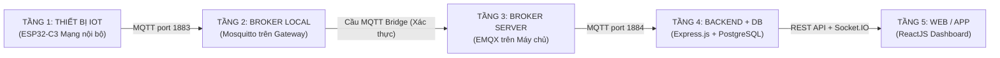

# ĐỐI CHIẾU KIẾN TRÚC ĐỒ ÁN VỚI YÊU CẦU BẮT BUỘC (MỤC 6.6)

Tài liệu này dùng để đưa vào **Cuốn báo cáo kết thúc môn** và **Thuyết trình bảo vệ đồ án**.

---

## 1. ĐỐI CHIẾU 3 CHỨC NĂNG BẮT BUỘC (SLIDE 18)

Slide 18 yêu cầu: *"Ba chức năng phải có: đăng ký thiết bị, xem telemetry, gửi lệnh"*.

| Chức năng bắt buộc | Vị trí trên hệ thống | Mô tả kỹ thuật |
| :--- | :--- | :--- |
| **1. Đăng ký thiết bị** | Tab **"ĐĂNG KÝ THIẾT BỊ"** trên Web React | Người dùng mở form nhập: Tên thiết bị, Node ID, Loại (Relay/LED/Sensor), MQTT Topic gốc. Hệ thống lưu vào PostgreSQL qua REST API `POST /api/devices`. |
| **2. Xem Telemetry** | Tab **"BẢNG ĐIỀU KHIỂN"** & **"ĐỒ THỊ"** | Hiển thị nhiệt độ (°C) và độ ẩm (%) theo thời gian thực qua WebSocket (Socket.IO) và vẽ biểu đồ lịch sử xu hướng bằng thư viện **Recharts**. |
| **3. Gửi lệnh (Command)** | Công tắc Toggle trên Web | Bấm nút bật/tắt trên Web ➔ Backend gửi MQTT Command xuống thiết bị ➔ Thiết bị phản hồi trạng thái thực tế. |

---

## 2. NĂM TẦNG BẮT BUỘC MỌI ĐỒ ÁN PHẢI ĐI QUA (SLIDE 19)

Kiến trúc hệ thống tuân thủ nghiêm ngặt mô hình 5 tầng:

### Chi tiết 5 tầng:

1. **TẦNG 1: Thiết bị IoT (Mạng nội bộ)**:
   - Các bo mạch **ESP32-C3** (Phòng Khách, Phòng Ngủ) đo DHT11 và điều khiển Relay/LED.
   - **Quy tắc**: *Thiết bị chỉ biết Broker Local, tuyệt đối không kết nối thẳng ra Internet*.
   - Địa chỉ kết nối của ESP32: `MQTT_BROKER = "IP_GATEWAY"` (Cổng 1883).

2. **TẦNG 2: Broker Local (Trên Gateway)**:
   - Chạy dịch vụ **Eclipse Mosquitto** đóng vai trò Gateway biên (Edge Broker).
   - Nhiệm vụ: Tiếp nhận dữ liệu từ các ESP32 trong mạng nội bộ, quản lý kết nối tại chỗ.
   - Cổng lắng nghe: `1883`.

3. **TẦNG 3: Broker Server (Trên Máy chủ / Cloud)**:
   - Chạy **EMQX Broker 5.6** đóng vai trò Server trung tâm.
   - Cổng giao tiếp: `1884` (TCP) và `18083` (Dashboard).
   - **Cầu nối Bridge**: Broker Local (Mosquitto) tự động mở một cầu nối Bridge `bridge-to-cloud-server` chuyển tiếp 2 chiều toàn bộ các topic `home/#` lên Broker Server với xác thực bảo mật (`remote_username` & `remote_password`).

4. **TẦNG 4: Backend + Database**:
   - Sử dụng **Node.js (Express)** và **PostgreSQL (Prisma ORM)**.
   - **Quy tắc**: *Backend chỉ kết nối duy nhất một điểm: Broker Server (Tầng 3)*.
   - Backend không kết nối trực tiếp vào ESP32 hay Broker Local.

5. **TẦNG 5: Web / Mobile Application**:
   - Sử dụng **ReactJS** (Vite + Dark Mode Glassmorphism).
   - Kết nối với Backend qua **RESTful API** (tải dữ liệu ban đầu, đăng ký thiết bị) và **WebSocket (Socket.IO)** để đẩy số đo realtime.

---

## 3. CHECKLIST SẢN PHẨM VÀ HỒ SƠ NỘP (SLIDE 18)

- [x] **Thiết bị gửi telemetry**: Đã lập trình ESP32-C3 gửi JSON `{temp, hum}` mỗi 5s.
- [x] **Broker MQTT Local & Broker MQTT Server có tài khoản**: Đã cấu hình Mosquitto Bridge và EMQX Server.
- [x] **Backend và PostgreSQL**: Đã có cấu trúc bảng `devices`, `sensor_readings`, `automations`, `activity_logs`.
- [x] **Dashboard**: Ứng dụng ReactJS hoàn chỉnh.
- [x] **Đăng ký thiết bị, xem telemetry, gửi lệnh**: Đã có đủ 3 chức năng trên Web.
- [ ] **Cuốn báo cáo kết thúc môn theo mẫu**: Dùng nội dung phân tích trong tài liệu này để đưa vào các chương của báo cáo.
- [ ] **Kịch bản demo và video dự phòng**: Quay video màn hình thao tác bấm trên Web và quay video mạch thật đóng ngắt relay.
